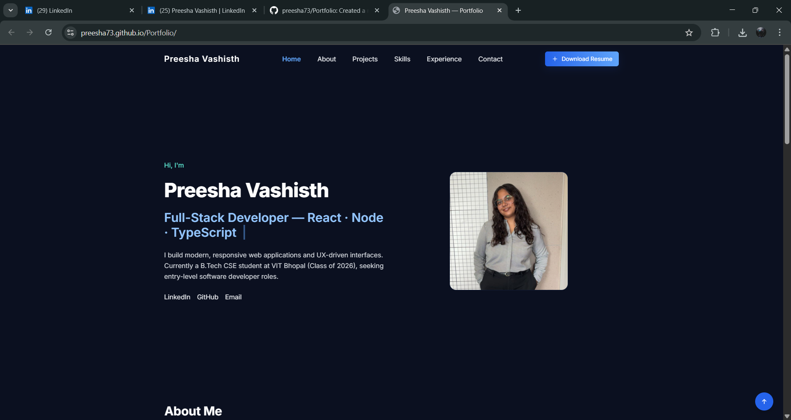
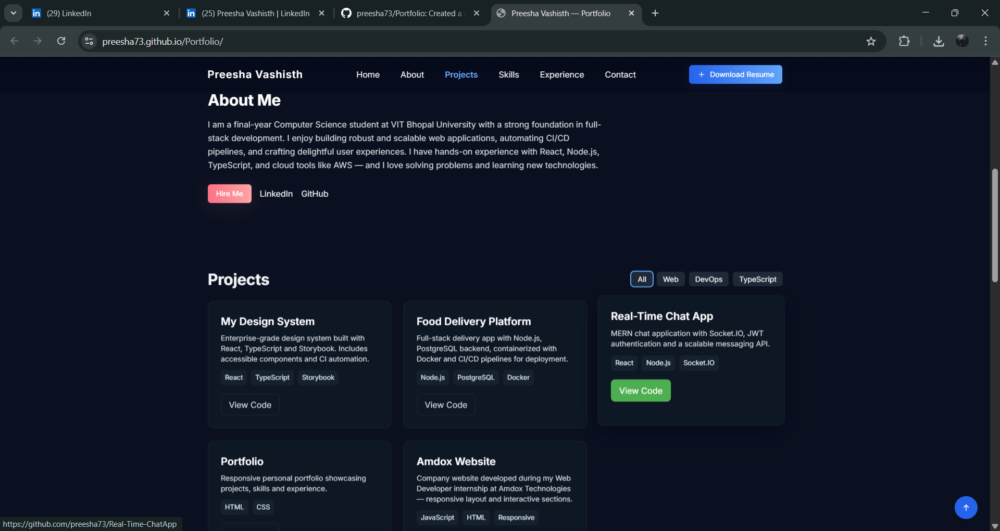
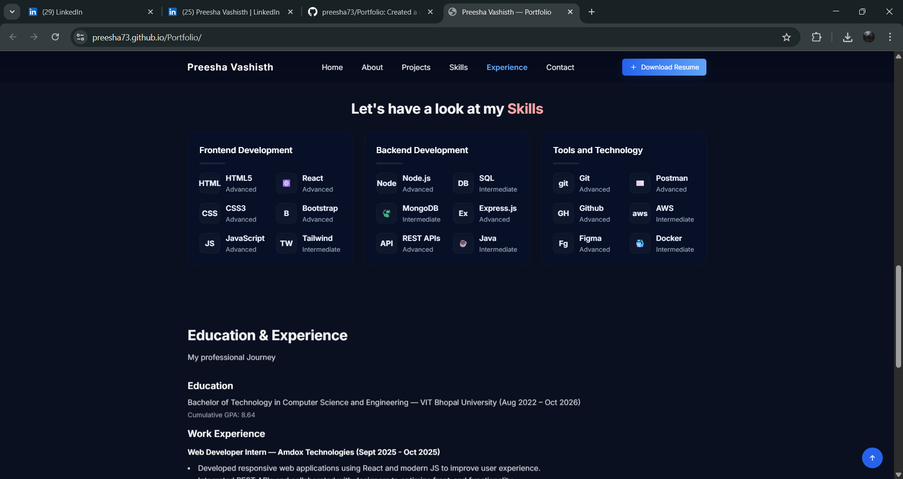
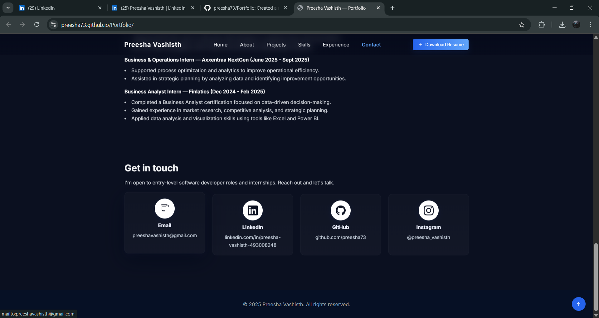

# My Portfolio Website — What I Built and How I Built It

This is my personal portfolio website. I created the layout, styling, and all interactivity using plain HTML, Tailwind (CDN), custom CSS, and vanilla JavaScript.

## What I built
- A responsive, dark-themed portfolio with sections for Hero, About, Projects, Skills, Experience, and Contact.
- A typing animation in the hero that cycles short phrases describing my role and skills.
- Interactive project cards with client-side filtering (using `data-tags`) and modals for details.
- A three-card Skills section grouping Frontend, Backend, and Tools.
- Contact cards with icons and a `mailto:` Hire Me button.
- Fade-in-on-scroll animations (IntersectionObserver), sticky header behavior, and a scroll-to-top button.

## Files
- `index.html` — main site structure and content.
- `styles.css` — custom CSS for animations, cards, modals and small design tweaks.
- `script.js` — client-side interactivity: typing, filtering, modals, fade-in, header behavior.
- `assets/` — images and my resume PDF (placeholders may be present).

## How to run this site locally (recommended)
I recommend running a small static HTTP server from the project folder so relative paths and scripts work reliably.

Using Python 3 (simplest):

```powershell
cd "C:\Users\ptpk2\Resume Portfolio Website"
python -m http.server 8888
# open http://localhost:8888 in your browser
```

Or using Node (no global install required):

```powershell
cd "C:\Users\ptpk2\Resume Portfolio Website"
npx http-server -p 8888
# open http://127.0.0.1:8888
```

## Deploying 
- GitHub Pages: enable Pages on the `main` branch and serve from the root.

## Live demo

The site can be deployed to Vercel, GitHub Pages, or any static host. Example (update with your real URL after deploying):

- Example (GitHub Pages): https://preesha73.github.io/portfolio

Replace the URL above with the actual live URL once you deploy (Vercel or Pages). I can update this README with the real URL if you share it.

## Screenshots

Below are a few example screenshot placeholders.

Hero / Landing



Projects grid



Skills grid



Contact section


